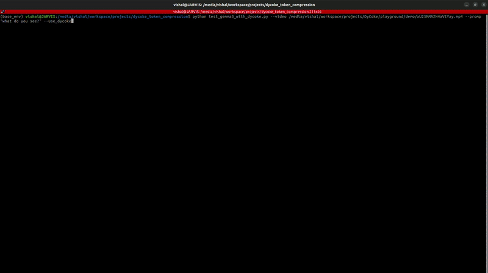
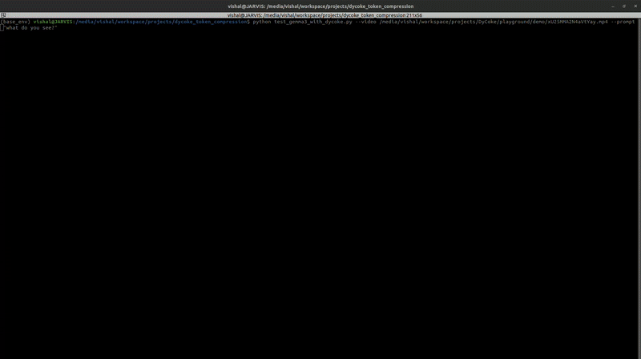

# dycoke_token_compression

This is **NOT** an official implementation of DyCoke. For the official implementation, please refer to this [repo](https://github.com/KD-TAO/DyCoke).

As compared to official implementation, This repo integrates DyCoke with more recent VLMs such as Gemma3 and Qwen2_5_vl


## Setup

To use this repo, you need two key packages to be installed in a venv with `python>=3.10`
```commandline
torch==2.5.1
tranformers==4.53.0
```

## Demo

To have a quick demo of DyCoke with Gemma3, please run

```commandline
python dycoke_demo_w_vlm.py --model_id "google/gemma-3-4b-it" --video resources/example_video.mp4 --prompt "Explain the video." --use_dycoke
```
For running demo with Qwen2_5_vl, please run
```commandline
python dycoke_demo_w_vlm.py --model_id "qwen/Qwen2.5-VL-3B-Instruct" --video resources/example_video.mp4 --prompt "Explain the video." --use_dycoke
```

DyCoke can be tunred off by removing `--use_dycoke` argument. Please note that to avoid OOM errors I have configured
`utils/video_reader.py` to select every 12th frame (in case of Gemma3). 

### Gemma3 with DyCoke vs Gemma3 without DyCoke

With DyCoke enabled Gemma3-4b-it model runs **~37 tokens/sec** whereas vanilla gemma3-4b-it runs around **~12 tokens/sec**

<table>
  <tr>
    <td align="center"><b>With DyCoke</b></td>
    <td align="center"><b>Without DyCoke</b></td>
  </tr>
  <tr>
    <td>
      
    </td>
    <td>
      
    </td>
  </tr>
</table>
